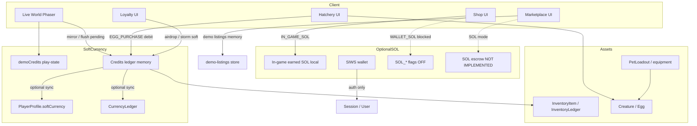
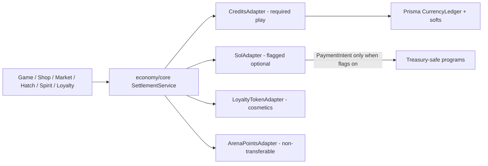
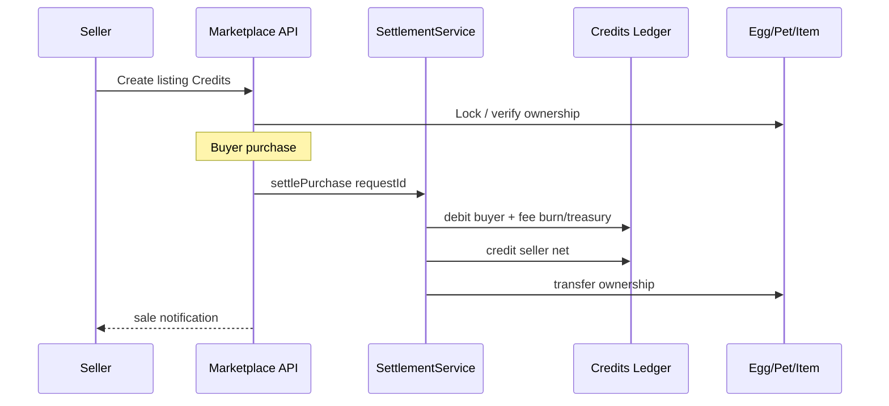

# Economy Architecture Map (as of Phase 0)

Current-state data flow for Credits, SOL, inventory, and marketplace. Target Phase 1+ unifies around a Master Economy Core facade without requiring SOL for play.

---

## Credits / SOL / inventory / marketplace (today)



---

## Target Master Economy Core (Phase 1+)



---

## Ownership transfer (marketplace intended)



Today the purchase route updates the in-memory listing and returns allocation math but **does not** call the Credits ledger.

---

## Spirit Recovery vs Care vs Shop Recovery

```mermaid
flowchart TB
  Down[Riftling Downed]
  Spirit[src/game/spirit recovery-service]
  Care[Care Credits sinks]
  ShopRec[/shop/recovery SOL catalog]
  Credits[Credits ledger]

  Down --> Spirit
  Spirit -->|SERVICE_FEE / Credits| Credits
  Care --> Credits
  ShopRec -.->|should become Credits SKU Phase 8-9| Credits
```

Integrate in Phase 8; do not duplicate Spirit logic.
