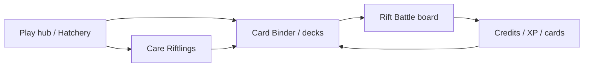
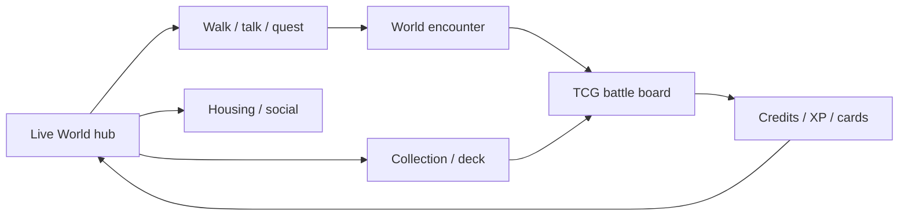

# Gameplay Loop — Riftwilds Reborn

**Status:** Product loop — **TCG-first launch**; Living World is a future release  
**Related:** [CARD_SYSTEM.md](./CARD_SYSTEM.md) · [PROJECT_VISION.md](../vision/PROJECT_VISION.md)

## Core loop (Phase 1 launch)

1. **Enter Play hub** (`/play`) — TCG-first dashboard; hatchery + binder CTAs.  
2. **Grow collection** (`/tcg/collection`) — cards from hatch / quests / seasons (progressive).  
3. **Battle** (`/tcg/battle`) — spend **Rift Energy**, play cards, short decisive match.  
4. **Care companions** — Riftlings remain the creature identity behind cards.  
5. **Credits sinks/faucets** — shop, marketplace cosmetics (wallet optional).

## Future loop (Living World release)

When `LIVE_WORLD_PUBLIC_ACCESS_ENABLED` is on:

- Route `/live-world` stays open during development (`LIVE_WORLD_PUBLIC_ACCESS_ENABLED` default on).  
- Optional pre-release gate: set public access off for Coming Soon; non-prod may still use `LIVE_WORLD_DEV_PREVIEW_ENABLED`.

## Daily / weekly

| Cadence | Activities |
|---------|------------|
| Daily | Binder, a few Rift Battles, care, loyalty check-in |
| Weekly | Season pass track, marketplace browsing |
| Seasonal | New card set themes, story beats, limited events |
| Future | Live World exploration, festivals, housing expression |

## What is *not* required

- Wallet / SOL  
- Living World enter (future release)  
- Ranked Arena pet battler (optional legacy / practice)  
- Real-money packs or gacha (`PAID_RANDOM_REWARDS_ENABLED` stays hard-off)

## Authority

- Client may demo movement and UI.  
- Match outcomes, Credits, and ownership resolve server-side (TCG match store → later Prisma).  
- Category A economy never trusts localStorage alone (`docs/persistence/`).
